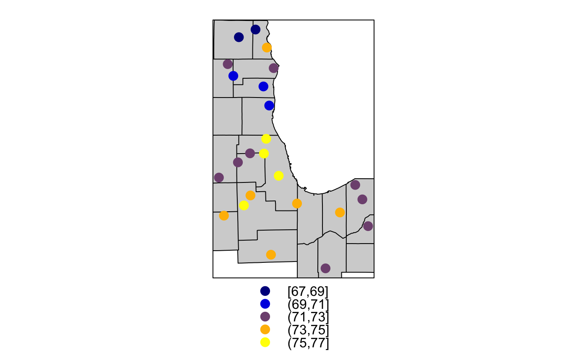

# Interpolation Models

## Introduction
Aerosol Optical Depth (AOD) data is remotely sensed using satellite technology. AOD values are estimated in a 1km x 1km grid pattern, where each grid cell is assigned an AOD value. AOD can estimate PM2.5 pollution concentrations at the surface after accounting for variables such as temperature, pressure, and others. Therefore, estimates of temperature, pressure, and others are also required for each 1km x 1km AOD grid cell. But, weather data is only measured at the location of a ground-based sensor. A spatial interpolation technique is required to infer the temperatures in grid cells without weather sensors. The map below shows the location of temperature sensors and average summer temperature at each sensor location. The grey areas of the map represent areas where temperature must be inferred.

```{r, echo=FALSE, fig.cap="Temperature Sensor Locations (Lorenz Menendez)"}

```

The following tutorial provides examples of common spatial interpolation methods used in the spatial data analysis community. While some methods are more complex and computationally expensive, all methods take into account the location and recorded values at various point sensor locations to generate an estimate at the unknown locations.

This tutorial follows the steps provided in an R-Spatial [tutorial](https://rspatial.org/raster/analysis/4-interpolation.html#calfornia-air-pollution-data) on pollution variable interpolations. Interpolation models tested include voronoi polygons, nearest neighbor interpolation, inverse distance weighting (IDW), and finally spatial kriging. Don't worry if you are unfamiliar with the methods, as they will be explained throughout the tutorial.

## Environment Setup

The following packages must be installed on your computer before proceeding

* `readr`, for ultra-fast CSV data reading
* `dyplr`, for data frame manipulation
* `sf`, for vector data manipulation
* `sp`, for vector & raster data manipulation
* `tmap`, for cartography
* `raster`, for raster data manipulation
* `dismo`, for voronoi interpolation 
* `gstat`, for spatio-statistical interpolation
* `automap`, for kriging interpolation

Let's library the above packages


```{r message=FALSE, warning=FALSE}
library(readr)
library(dplyr)
library(sf)
library(sp)
library(tmap)
library(raster)
library(dismo)
library(gstat)
library(automap)
tmap_mode('view')
```


## Importing Temperature Sensor Data

Temperature data is the variable to be interpolated in this tutorial. In the code below, avergae monthly temperature for August 2018 at each sensor location is loaded into R. Other weather variables were also interpolated using similar methods, but these are omitted for brevity. For more information on compiling a weather dataset, refer to Appendix A.

```{r message=FALSE, warning=FALSE, paged.print=TRUE}

tmpf = readr::read_csv('./data/ASOS_tmpf_2014.2018.csv') %>% 
  filter(moyr == "2018-08")

tmpf
```

The three-letter airport identifier is in the `site_num` column, while spatial data information is housed as coordinates in the `latitude` and `longitude` columns. Monthly average temperature is in the `tmpf` column. Next, the imported `data.frame` is converted to a spatial `sf` object and plotted in an interactive map using `tmap`. Notice how temperatures in the northern counties tend to be significantly colder than temperaturs in the southern counties.

```{r message=FALSE, warning=FALSE, results = 'hide'}
counties = sf::st_read('./data/LargeAreaCounties/LargeAreaCounties.shp')
sensors = sf::st_as_sf(tmpf, coords = c("longitude", "latitude"), crs = 4326)

tm_shape(counties) +
  tm_borders() +
tm_shape(sensors) +
  tm_dots(col = "tmpf", 
          palette = "-RdBu", 
          title = "Average August 2018 Temperature (ºF)", 
          popup.vars = c("Temp" = "tmpf", 
                         "Airport Code" = "site_num"))
```


## Interpolating Temperature

In the following sections, a variety of interpolation models are applied to monthly temperature averages. The interpolation methods are ordered by their complexity and sophistication, with the simplest methods first.

### Voronoi Tesselation {-}
Voronoi tesselation, also known as Thiessen polygons, is an interpolation method whereby grid cells are assigned the temperature value of the nearest temperature sensor. First, the Thiessen polygons are created using the `dismo` package. The map below shows the area assigned to each sensor location, which are marked by black dots.

```{r include=FALSE}
library(raster)

# Loading AOD raster for the 21 counties
AOD.raster = raster::raster('./data/AOD_21Counties_MasterGrid/AOD_21Counties_MasterGrid.grd')

# Create Blank Raster with same properties as AOD raster
blank.raster = raster()
crs(blank.raster) = sf::st_crs(AOD.raster)$proj4string
extent(blank.raster) = extent(AOD.raster)
res(blank.raster) = res(AOD.raster)
crs(blank.raster) = st_crs(sensors)$proj4string


# Replacing with NA Values
values(blank.raster) = NA

# Converting sf object to sp
dsp = as_Spatial(sensors)
IL = as_Spatial(counties)
```

```{r mesage=FALSE, warning = FALSE}
library(dismo)
v <- voronoi(dsp)

tm_shape(v) +
  tm_borders() +
tm_shape(sensors) +
  tm_dots(popup.vars = c("Temp" = "tmpf", 
                         "Airport Code" = "site_num"))

```

The Thiessen polygons are converted from vector polygons to raster data, and the corresponding temperature values are assigned.

```{r message=FALSE, warning=FALSE}
# Assigning values to polygons
il <- aggregate(IL)
vil <- raster::intersect(v, il)

tm_shape(vil) +
  tm_fill('tmpf', 
          alpha = 0.5, 
          palette = "-RdBu", 
          title = "Average August 2018 Temperature (ºF)",
          popup.vars = c("Temp" = "tmpf")) + 
  tm_borders()

r <- blank.raster
vr <- rasterize(vil, r, 'tmpf')

```

### Nearest Neighbor {-}
Similar to the Voronoi, this method assigns temperature values by taking the average of a fixed number of nearby temperature sensors. Note that a nearest neighbor interpolation with the number of neighbors set to 1 is equivalent to a Voronoi tesselation. The method coded takes into account the five nearest temperature sensors.

```{r warning = FALSE, message = FALSE}
set.seed(5132015)

gs <- gstat(formula=tmpf~1, locations=dsp, nmax=5, set=list(idp = 0))
nn <- interpolate(r, gs)

nnmsk <- mask(nn, vr)

tm_shape(nnmsk) +
  tm_raster(n = 5,
            alpha = 0.5, 
            palette = "-RdBu", 
            title = "Average August 2018 Temperature (ºF)")
```

### Inverse Distance Weighted {-}

This model extends the nearest neighbor interpolation by not only taking into account multiple sensors, but also the relative distance between grid cell and sensors. Temperature values from sensors located closer to the grid cell are given more influence (higher weights) on the assigned tempertaure value than sensors located further away from the grid cell (lower weights). This model is a logical outcropping of Tobler's first law of geography, "everything is related to everything else, but nearer things are more related than distant things."

```{r warning = F, message = F, results = 'hide'}
set.seed(5132015)
gs <- gstat(formula=tmpf~1, locations=dsp)
idw <- interpolate(r, gs)
idwr <- mask(idw, vr)

tm_shape(idwr) +
  tm_raster(n = 10,
            alpha = 0.5, 
            palette = "-RdBu", 
            title = "Average August 2018 Temperature (ºF)")
```

The IDW model creates a smoother temperature surface compared to voronoi and nearest neighbor interpolations. Hard breaks between individual sensor regions is reduced to a minimum. However, IDW also introduced its own distortion, the 'bullseye'. This effect occurs when a sensor value is significantly different than the rest, an artefact that is clearly visible around almost all snesor locations in our map.

### IDW Optimiziation {-}
IDW interpolations depend on two user-defined parameters, the number of sensors to consider, and a friction of distance coefficient describing how strong closer senors should be weighted relative to farther ones. Using an error metric such as Root-Mean Square Error (or RMSE), optimal parameters that minimize RMSE could be found. This optimization is performed below.

```{r, include=F}
RMSE <- function(observed, predicted) {
  sqrt(mean((predicted - observed)^2, na.rm=TRUE))
}
```


```{r message = F, warning = F}
f1 <- function(x, test, train) {
  nmx <- x[1]
  idp <- x[2]
  if (nmx < 1) return(Inf)
  if (idp < .001) return(Inf)
  m <- gstat(formula=tmpf~1, locations=train, nmax=nmx, set=list(idp=idp))
  p <- predict(m, newdata=test, debug.level=0)$var1.pred
  RMSE(test$tmpf, p)
}

i <- sample(nrow(dsp), 0.2 * nrow(dsp))
tst <- dsp[i,]
trn <- dsp[-i,]
opt <- optim(c(8, .5), f1, test=tst, train=trn)
opt
```

The optimal IDW interpolation can be gleaned from the `opt$par` variable. The number of sensors to consider should be ~4.90 while the decay parameter should be 8.44.

Performing the IDW interpolation with these parameters yields the following results.

```{r message = F, warning = F, results = 'hide'}
m <- gstat::gstat(formula=tmpf~1, locations=dsp, nmax=opt$par[1], set=list(idp=opt$par[2]))
idw <- interpolate(r, m)
idw <- mask(idw, il)

tm_shape(idw) +
  tm_raster(n = 10,
            alpha = 0.5, 
            palette = "-RdBu", 
            title = "Average August 2018 Temperature (ºF)")
```

The output from this method is super interesting. It looks similar to the voronoi polygons, but as if someone took a paintbrush to the edges of each polygon and mixed the colors together. In scientific terms, it's as if someone took the voronoi polygons and added a thin gradient between each polygon. 

### Ordinary Kriging {-}
Kriging is a complex interpolation method that seeks to find the best linear predictor of average temperature for unknown grid cells.

The first step is to fit a variogram over the temperature data

```{r}
library(gstat)
gs <- gstat(formula=tmpf~1, locations=dsp)
v <- variogram(gs, width=20)
head(v)
plot(v)
```

We notice that there are only five points below the mean, which is very few points to properly fit a model to. But, let's continue to see what happens. Next we fit the variogram. This time, we use the ```autofitVarogram``` function from the ```automap``` package.

```{r}
fve = automap:::autofitVariogram(formula = tmpf~1, input_data = dsp)
fve
plot(fve)
```

The ```autofitVariogram``` function fitted a Gaussian variogram to our small sample of datapoints. 

Executing an ordiary kriging model

```{r message = F, warning = F, results = 'hide'}
kp = krige(tmpf~1, dsp, as(blank.raster, 'SpatialGrid'), model=fve$var_model)
spplot(kp)
```

Plotting this on the 21 counties

```{r}
ok <- brick(kp)
ok <- mask(ok, il)
names(ok) <- c('prediction', 'variance')
plot(ok)

tm_shape(ok[[1]]) +
  tm_raster(n = 5,
            alpha = 0.5, 
            palette = "-RdBu", 
            title = "Average August 2018 Temperature (ºF)")
```

## Method Selection Criteria

After examining the reuslts of each method, a single one must be chosen. Root Mean Square Error (or RMSE) was chosen as a performance metric to compare each method. The method with the lowest RMSE was chosen for the final interpolation. RMSE is calculated using the following formula. $predicted$ is the predicted temperature value by the interpolation method at a sensor location. $observed$ is the true temperature value recorded at the sensor location. The difference between $predicted$ and $observed$ is then squared. The mean of the squared errors across multiple sensor locations is taken, then the square root. The formula is saved as an R function named `RMSE`, as shown in the code snippet below.


$$RMSE = \sqrt{mean((predicted - observed)^2)}$$


```{r}
RMSE <- function(observed, predicted) {
  sqrt(mean((predicted - observed)^2, na.rm=TRUE))
}
```

Before choosing any model, it must first be proved than the interpolation method effectively captures the variability in the dataset. To do this, we first calculate RMSE where the predicted temperature value is the mean of all temperature values in the dataset. Formally, we are calculating the RMSE of the *null model*, where there is no change in termperature over space.

```{r}
RMSE <- function(observed, predicted) {
  sqrt(mean((predicted - observed)^2, na.rm=TRUE))
}

null <- RMSE(mean(tmpf$tmpf), tmpf$tmpf)
null

```

The Root Mean Square Error (RMSE) for the null model is `2.09`. When RMSE of an interpolation model is below `2.09`, this could be an indication that the model is unable to effectively capture the variability in the original temperature dataset and does not provide any improvement in our understanding of temperature across the 21 counties.

### Calculating RMSE
This section demonstrates how to calculate RMSE for each method applied above. The first step is to randomly partition the sensors into give groups, numbered 1 through 5. Then, for each group, the interpolation method is applied using all sensors outside the group. Then, RMSE is calculated for sensors in the chosen group. For example, when calculating RMSE for group 1, the interpolation method is applied using data from sensosrs in groups 2,3,4,5. Then, RMSE is calculated using the predicted values at the locations of sensors in group 1. This process is repeated for all groups 1 through 5. This methodology is called *cross-validation*, and since five groups are used one can say, *five-fold cross-validation*. The number of groups is set at five due to the limited number of available sensors.

The following code block is an implementation of five-fold cross-validation for the Voronoi Tesselation method. Note that the `set.seed()` function allows to keep the same random group selection each time you run the code block. The code outputs the resulting RMSE and a percent improvement over the RMSE of the null model. 

```{r warning= FALSE, message = FALSE, collapse = TRUE}
set.seed(5132015)

# Randomly partition the Dataset into 5 groups (1 through 5)
kf <- kfold(nrow(dsp)) 

# Initialize a vector of length 5
vorrmse <- rep(NA, 5)

# Validate
for (k in 1:5) {
  test <- dsp[kf == k, ] # Learn on group k
  train <- dsp[kf != k, ] # Train on groups != k
  v <- voronoi(train)
  p1 <- raster::extract(v, test)$tmpf
  vorrmse[k] <- RMSE(test$tmpf, p1) # Save the RMSE
}

print(paste("Mean RMSE",
mean(vorrmse),
"Improvement over NULL model",
1 - (mean(vorrmse) / null)))
```

Code snippets of five-fold cross-validation for the other interpolations are below.


```{r message=FALSE, warning=FALSE, collapse=T}
# Nearest Neighbor

nnrmse <- rep(NA, 5)

for (k in 1:5) {
  test <- dsp[kf == k, ]
  train <- dsp[kf != k, ]
  gs <- gstat(formula=tmpf~1, locations=train)
  p <- predict(gs, test)
  nnrmse[k] <- RMSE(test$tmpf, p$var1.pred)
}


print(paste("Mean RMSE",
mean(nnrmse),
"Improvement over NULL model",
1 - (mean(nnrmse) / null)))

```

```{r warning = F, message = F, collapse = T}
# Inverse Distance Weighted

idwrmse <- rep(NA, 5)

for (k in 1:5) {
  test <- dsp[kf == k, ]
  train <- dsp[kf != k, ]
  m <- gstat(formula=tmpf~1, locations=train, nmax=opt$par[1], set=list(idp=opt$par[2]))
  p4 <- predict(m, test)$var1.pred
  idwrmse[k] <- RMSE(test$tmpf, p4)
}

print(paste("Mean RMSE",
mean(idwrmse),
"Improvement over NULL model",
1 - (mean(idwrmse) / null)))

```

```{r warning = F, message = F, collapse = T}
# Ordinary Kriging

krigrmse = rep(NA, 5)

for (i in 1:5) {
  test <- dsp[kf == i,]
  train <- dsp[kf != i, ]
  fve = automap:::autofitVariogram(formula = tmpf~1, input_data = train)
  kp = krige(tmpf~1, train, as(blank.raster, 'SpatialGrid'), model=fve$var_model)
  p6 = raster::extract(as(kp, 'RasterLayer'), test)
  krigrmse[i] <-  RMSE(test$tmpf, p6)
}

print(paste("Mean RMSE",
mean(krigrmse),
"Improvement over NULL model",
1 - (mean(krigrmse) / null)))

```

Below is a summary of RMSE and imporvement over the null for the four interpolation methods studied.

| Method                    | RMSE | Improvement over Null |
|---------------------------|------|-----------------------|
| Voronoi Polygon           | 1.34 | 36.16%                |
| Nearest Neighbor          | 1.52 | 27.44%                |
| Inverse Distance Weighted | 1.43 | 31.93%                |
| Ordinary Kriging          | 1.80 | 14.17%                |

## Further Reading {-}
* See this [R-Spatial tutorial](https://rspatial.org/raster/analysis/4-interpolation.html#calfornia-air-pollution-data) for an application of this metholdogy on pollution sensor data in California.
* See [this](https://mgimond.github.io/Spatial/interpolation-in-r.html) appendix from *Intro to GIS and Spatial Analysis* by Manual Gimond